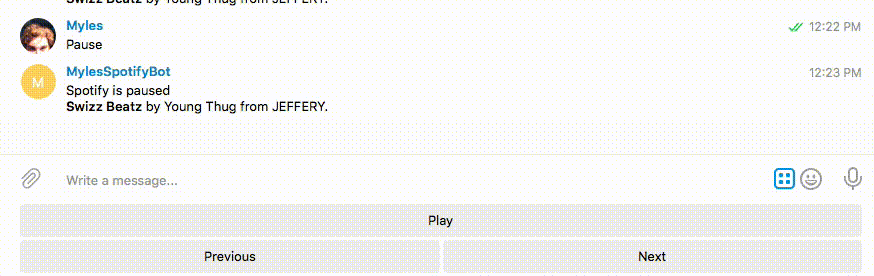

footer: Myles Braithwaite | [mylesb.ca](http://mylesb.ca/) | [me@mylesb.ca](mailto:me@mylesb.ca) | [@mylesb](https://twitter.com/mylesb)
slidenumbers: true

# [fit] Chat Bots

# [fit] TODO something cute vaguely related to chat bots

---

# [fit] Telegram Is Not Secure

# [fit] But it's Awesome for Writing Chat Bots

---

- Telegram is an instant message service
- It has desktop and mobile clients
- Uses a non-standered encryption protocol MTProto

---


- Talk with the @BotFather
- Register `/` commands

^ To get a Telegram bot you have to talk with the BotFather and register your bot's username.

^ You can also register slash commands.

---


# [fit] python-telegram-bot.org

^ This talk will mainly go over the Python Telegram Bot Python Library.

---

```python
from telegram.ext import Updater, CommandHandler


def start(bot, update):
    bot.sendMessage(update.message.chat_id, text='Hello World!')


def hello(bot, update):
    bot.sendMessage(update.message.chat_id,
                text='Hello {}.'.format(update.message.from_user.first_name))


updater = Updater('YOUR TOKEN HERE')

updater.dispatcher.add_handler(CommandHandler('start', start))
updater.dispatcher.add_handler(CommandHandler('hello', hello))

updater.start_polling()
updater.idle()
```

^ Here is their example but it's so boring.

---

# [fit] Let's Control *Spotify* with Telegram

<https://github.com/myles/telegram-spotify-bot>

---


---

```python
def command_start(self, bot, update):
    msg = ("Hi! I'm a bot to control @MylesB's"
           "Spotify account.")

    self.send_message(bot, update, msg)
```

^ This is really boring sorry.

---


---

```python
def command_status(self, bot, update):
    # Check ot see if Spotify is currently running.
    if not self.control.is_running():
        return self.send_message(bot, update, 'Spotify is not running.')

    # Get the current Player State and Track
    player_state = self.control.player_state()
    current_track = self.control.current_track()

    if player_state == 'stopped':
        return seld.send_message(bot, update, 'Spotify is stopped.')

    msg_line_one = 'Spotify is {0}\n'.format(player_state)
    msg_line_two = ('*{name}* by {artist} from '
                    '{album}.').format(**current_track)
```

---



---

```python
def send_message(self, bot, update, msg, disable_link_preview=True,
                 **kwargs):
    return bot.sendMessage(update.message.chat_id, msg,
                           reply_markup=ReplyKeyboardMarkup(self.keyboard),
                           resize_keyboard=True,
                           parse_mode=ParseMode.MARKDOWN,
                           disable_web_page_preview=disable_link_preview,
                           **kwargs)
```

---


---

```python
@property
def keyboard(self):
    if self.control.player_state() == 'playing':
        play_pause_button = KeyboardButton('Pause')
    else:
        play_pause_button = KeyboardButton('Play')

    return [[play_pause_button],
            [KeyboardButton('Previous'), KeyboardButton('Next')]]
```

---


---

```python
def command_search(self, bot, update, args):
    results = self.spotify.search(q=' '.join(args))

    msgs = []

    result_msg = '*{0}* by {1} /play {2}'

    for r in results['tracks']['items']:
        msgs.append(result_msg.format(r['name'], r['artists'][0]['name'],
                                      r['uri']))

    self.send_messages(bot, update, msgs)
```

---

Presentation: <https://github.com/myles/2016-09-21-chat-bots>
Telegram SpotifyBot: <https://github.com/myles/telegram-spotify-bot>

---

# [fit] Questions